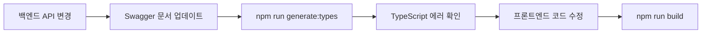

# 🔄 Swagger → TypeScript 자동 타입 생성 가이드

> `openapi-typescript`를 사용하여 백엔드 Swagger 명세를 TypeScript 타입으로 자동 변환

---

## 📋 목차

1. [설정 완료](#-설정-완료)
2. [사용 방법](#-사용-방법)
3. [생성된 타입 활용](#-생성된-타입-활용)
4. [기존 타입과 통합](#-기존-타입과-통합)
5. [워크플로우](#-권장-워크플로우)
6. [트러블슈팅](#-트러블슈팅)

---

## ✅ 설정 완료

### 설치된 패키지
```json
{
  "devDependencies": {
    "openapi-typescript": "^7.13.0"
  }
}
```

### 추가된 NPM 스크립트
```json
{
  "scripts": {
    "generate:types": "openapi-typescript http://localhost:8080/v3/api-docs -o src/types/api.generated.ts",
    "generate:types:local": "openapi-typescript swagger.json -o src/types/api.generated.ts"
  }
}
```

---

## 🚀 사용 방법

### **방법 1: 백엔드 서버에서 직접 생성 (추천)**

#### 전제 조건
- 백엔드 서버가 `http://localhost:8080`에서 실행 중
- Swagger 문서가 `/v3/api-docs` 엔드포인트에서 제공됨

#### 실행
```bash
# 백엔드 서버 실행 확인
curl http://localhost:8080/v3/api-docs

# 타입 생성
npm run generate:types
```

#### 결과
```
✓ Generated TypeScript types from http://localhost:8080/v3/api-docs
✓ Written to src/types/api.generated.ts
```

---

### **방법 2: 로컬 Swagger JSON 파일 사용**

#### 1단계: Swagger JSON 다운로드
```bash
# 백엔드 서버에서 다운로드
curl http://localhost:8080/v3/api-docs > swagger.json

# 또는 브라우저에서 다운로드
# http://localhost:8080/swagger-ui/index.html
# → "API Docs" 링크 클릭 → JSON 저장
```

#### 2단계: 타입 생성
```bash
npm run generate:types:local
```

---

### **방법 3: 다른 서버 URL 사용**

```bash
# 개발 서버
npx openapi-typescript http://dev-server.com/v3/api-docs -o src/types/api.generated.ts

# 스테이징 서버
npx openapi-typescript http://staging-server.com/v3/api-docs -o src/types/api.generated.ts

# 프로덕션 서버 (주의!)
npx openapi-typescript https://api.production.com/v3/api-docs -o src/types/api.generated.ts
```

---

## 📦 생성된 타입 활용

### 생성된 파일 구조

```typescript
// src/types/api.generated.ts (자동 생성)

export interface paths {
  "/api/auction": {
    get: operations["getAuctions"];
    post: operations["createAuction"];
  };
  "/api/auction/{id}": {
    get: operations["getAuction"];
    patch: operations["updateAuction"];
    delete: operations["deleteAuction"];
  };
  // ... 모든 엔드포인트
}

export interface components {
  schemas: {
    AuctionResponseDto: {
      id: number;
      title: string;
      description: string;
      currentPrice: number;
      status: "ACTIVE" | "CLOSED" | "CANCELED";
      // ... 모든 필드
    };
    BidsResponseDto: {
      bidPrice: number;  // ✅ Swagger 명세 그대로
      bidAt: string;
      bidder: components["schemas"]["UserSummaryDto"];
    };
    // ... 모든 스키마
  };
}

export interface operations {
  getAuctions: {
    parameters: {
      query?: {
        page?: number;
        size?: number;
        status?: string;
      };
    };
    responses: {
      200: {
        content: {
          "application/json": components["schemas"]["PageAuctionSummaryDto"];
        };
      };
    };
  };
  // ... 모든 오퍼레이션
}
```

---

### 타입 사용 예시

#### **Before: 수동 타입 정의**
```typescript
// src/types/api.ts
export interface BidSummary {
  id: number;
  bidPrice: number;      // 수동으로 Swagger 보고 작성
  bidAt: string;         // 오타 가능성, 명세 변경 시 수동 업데이트
  bidder: {
    id: number;
    username: string;
  };
}
```

#### **After: 자동 생성 타입 활용**
```typescript
// src/types/api.ts
import type { components } from './api.generated';

// 자동 생성된 타입 재사용
export type BidSummary = components['schemas']['BidsResponseDto'];

// 또는 확장
export interface BidSummaryExtended extends components['schemas']['BidsResponseDto'] {
  // 프론트엔드 전용 필드 추가
  isMyBid?: boolean;
  formattedDate?: string;
}
```

---

## 🔗 기존 타입과 통합

### 전략 1: 점진적 마이그레이션 (추천)

```typescript
// src/types/api.ts
import type { components, operations } from './api.generated';

// ==================== 기존 타입 유지 ====================
export interface ProjectResponse {
  // 기존 코드 유지 (당장 변경 불필요)
}

// ==================== 새로운 타입은 자동 생성 활용 ====================
// Swagger 명세와 100% 일치 보장
export type AuctionResponseDto = components['schemas']['AuctionResponseDto'];
export type BidsResponseDto = components['schemas']['BidsResponseDto'];
export type UserSummaryDto = components['schemas']['UserSummaryDto'];

// ==================== API 파라미터 타입 ====================
export type GetAuctionsParams = operations['getAuctions']['parameters']['query'];
export type CreateAuctionRequest = operations['createAuction']['requestBody']['content']['multipart/form-data'];

// ==================== 기존 export 유지 (하위 호환성) ====================
export type BidSummary = BidsResponseDto; // 별칭으로 기존 이름 유지
export type AuctionResponse = AuctionResponseDto;
```

---

### 전략 2: 완전 자동화

```typescript
// src/types/api.ts
export * from './api.generated';

// 프론트엔드 전용 타입만 추가
export interface FrontendOnlyType {
  // 백엔드와 무관한 UI 상태 등
}
```

---

## 🔄 권장 워크플로우

### **개발 흐름**



### **1일 1회 실행 (추천)**

```bash
# 매일 아침 또는 백엔드 업데이트 후
npm run generate:types

# TypeScript 에러 확인
npm run build
```

### **Git Workflow**

#### 옵션 A: `api.generated.ts`를 Git에 커밋 (추천)
```bash
# .gitignore (변경 없음)

# 장점: 팀원들이 백엔드 없이 개발 가능
# 단점: diff가 크게 나올 수 있음
```

#### 옵션 B: `api.generated.ts`를 .gitignore에 추가
```bash
# .gitignore
src/types/api.generated.ts

# 장점: diff 깔끔
# 단점: 각 개발자가 백엔드 서버 필요
```

---

## 📊 Before & After 비교

### **Before: 수동 타입 관리**

```typescript
// 1. Swagger 문서 열기
// 2. 복붙
export interface BidResponse {
  amount: number;        // ❌ 실제는 bidPrice
  createdAt: string;     // ❌ 실제는 bidAt
  bidder: {
    id: number;
    username: string;
  };
}

// 3. 백엔드 API 변경 시
// 4. Swagger 다시 확인
// 5. 타입 수정
// 6. 컴포넌트 50개 파일 수정...
```

### **After: 자동 타입 생성**

```bash
# 1. 백엔드 API 변경
# 2. 타입 재생성
npm run generate:types

# 3. TypeScript가 자동으로 에러 표시
# Type 'string' is not assignable to type 'number'

# 4. IDE가 정확한 필드명 자동완성
auction.bidPrice // ✅
auction.amount   // ❌ 컴파일 에러
```

---

## 🎯 실전 예제

### 예제 1: API 요청 함수에 타입 적용

```typescript
// src/services/auctionService.ts
import type { components, operations } from '@/src/types/api.generated';

type AuctionResponse = components['schemas']['AuctionResponseDto'];
type GetAuctionsParams = operations['getAuctions']['parameters']['query'];

export const auctionApi = {
  getAuctions: async (params?: GetAuctionsParams): Promise<AuctionResponse[]> => {
    // params 타입이 자동으로 잡힘
    const query = new URLSearchParams({
      page: params?.page?.toString() ?? '0',
      size: params?.size?.toString() ?? '10',
      status: params?.status ?? '',
    });
    
    return await apiRequest(`/api/auction?${query}`);
  },
};
```

---

### 예제 2: Form Validation

```typescript
// src/lib/validations.ts
import { z } from 'zod';
import type { components } from '@/src/types/api.generated';

type AuctionCreateRequest = components['schemas']['AuctionRequestDto'];

// Swagger 명세 기반 Zod 스키마
export const auctionSchema = z.object({
  title: z.string().min(1).max(100),
  description: z.string().min(10),
  startPrice: z.number().min(1000),
  bidStep: z.number().min(1000),
  endAt: z.string().refine((val) => new Date(val) > new Date()),
  categoryPath: z.string(),
  tags: z.array(z.string()).nullable().optional(),
  summary: z.string().max(200).nullable().optional(),
}) satisfies z.ZodType<Omit<AuctionCreateRequest, 'file'>>;
```

---

## 🛠️ 트러블슈팅

### 문제 1: `Cannot find module 'openapi-typescript'`

```bash
# 해결: 재설치
npm install -D openapi-typescript
```

---

### 문제 2: `Connection refused` (백엔드 서버 미실행)

```bash
# 증상
Error: connect ECONNREFUSED 127.0.0.1:8080

# 해결: 백엔드 서버 실행 또는 로컬 파일 사용
npm run generate:types:local
```

---

### 문제 3: `Invalid OpenAPI document`

```bash
# 증상
Error: Invalid OpenAPI document

# 원인: Swagger JSON 형식 오류
# 해결: 백엔드 팀에 Swagger 문서 검증 요청
# https://editor.swagger.io/ 에서 검증
```

---

### 문제 4: 생성된 타입이 너무 복잡함

```typescript
// 문제: 중첩된 타입이 길어짐
type T = components['schemas']['PageAuctionSummaryDto']['content'][number];

// 해결: 별칭 생성
export type AuctionSummary = components['schemas']['AuctionSummaryDto'];
export type AuctionPage = components['schemas']['PageAuctionSummaryDto'];
```

---

### 문제 5: 타입 변경 후 캐시 문제

```bash
# IDE 재시작
# 또는 타입 캐시 삭제
rm -rf node_modules/.cache
npm run build
```

---

## 🎓 고급 활용

### 1. 특정 스키마만 추출

```typescript
// src/types/auction.types.ts
import type { components } from './api.generated';

export namespace Auction {
  export type Response = components['schemas']['AuctionResponseDto'];
  export type Summary = components['schemas']['AuctionSummaryDto'];
  export type CreateRequest = components['schemas']['AuctionRequestDto'];
  export type Status = components['schemas']['AuctionStatus'];
}

// 사용
import { Auction } from '@/src/types/auction.types';
const auction: Auction.Response = await getAuction(1);
```

---

### 2. API 응답 타입 자동 추론

```typescript
import type { operations } from './api.generated';

type ApiResponse<T extends keyof operations> = 
  operations[T]['responses'][200]['content']['application/json'];

// 사용
type GetAuctionResponse = ApiResponse<'getAuction'>;
type GetAuctionsResponse = ApiResponse<'getAuctions'>;
```

---

### 3. 에러 타입 추출

```typescript
type ApiError<T extends keyof operations> = 
  operations[T]['responses'][400 | 404 | 500]['content']['application/json'];

type GetAuctionError = ApiError<'getAuction'>;
```

---

## 📚 참고 자료

### 공식 문서
- [openapi-typescript GitHub](https://github.com/drwpow/openapi-typescript)
- [OpenAPI 3.0 Specification](https://swagger.io/specification/)

### 관련 도구
- [openapi-fetch](https://github.com/drwpow/openapi-typescript/tree/main/packages/openapi-fetch): 타입 안전한 fetch 클라이언트
- [Swagger Editor](https://editor.swagger.io/): Swagger 문서 검증

### DDIP 프로젝트 문서
- `API_REFACTORING_JOURNEY.md`: API 리팩토링 여정
- `PROJECT_STRUCTURE.md`: 프로젝트 구조
- `INTERVIEW_POINTS.md`: 면접 포인트

---

## ✅ 체크리스트

설정이 완료되었나요?

- [x] `openapi-typescript` 설치
- [x] `package.json` 스크립트 추가
- [ ] 백엔드 서버 실행 확인
- [ ] `npm run generate:types` 실행
- [ ] `src/types/api.generated.ts` 생성 확인
- [ ] 기존 `src/types/api.ts`와 통합
- [ ] `npm run build` 성공 확인

---

**다음 단계: 백엔드 서버를 실행하고 `npm run generate:types`를 실행해보세요!**

```bash
# 백엔드 서버 실행 (백엔드 디렉토리에서)
./gradlew bootRun
# 또는
java -jar backend.jar

# 프론트엔드에서 타입 생성
npm run generate:types

# 결과 확인
cat src/types/api.generated.ts | head -n 50
```

**완료 후 다음 문서를 확인하세요:**
- `API_REFACTORING_JOURNEY.md` - 타입 시스템 구축 과정
- `PROJECT_STRUCTURE.md` - 프로젝트 구조

---

**마지막 업데이트**: 2026년 2월 13일  
**버전**: 1.0.0  
**프로젝트**: DDIP (크라우드펀딩 & 경매 플랫폼)
